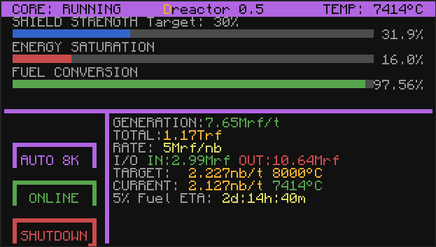
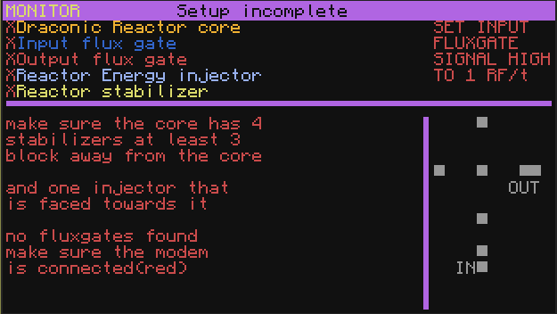

Dreactor is a simple draconic evolution  cc:tweaked program

-should autoadjust to almost any monitor size

-manual mode lets you set the gate output 

-autonbt lets you target a specific consumption rate 

-auto8k targets 8000°C (with a safety trottle if it reaches 16 saturation)

-if it detects a meltdown it should output a redstone signal to the top

-change the shield strength by clicking the shieldbar at the spot you want to target

-click the version on the top to open the build in updater

if it detects anything wrong it will show very basic info getting on what may be wrong

