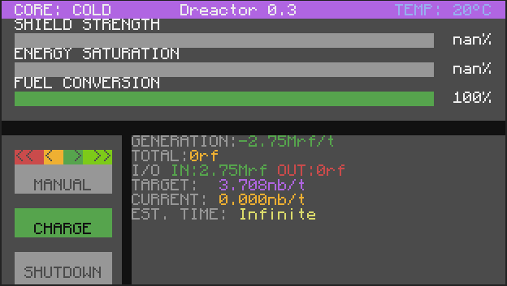

Dreactor is a simple draconic evolution  cc:tweaked program

-should autoadjust to almost any monitor size
-manual mode lets you set the gate output 
-autonbt lets you target a specific consumption rate 
-auto8k targets 8000°C (at the start it goes lower to start it with less risk of meltdown)
-if it detects a meltdown it should output a redstone signal to the top

there should be a updater included if i ever update it by clicking the version on the top
